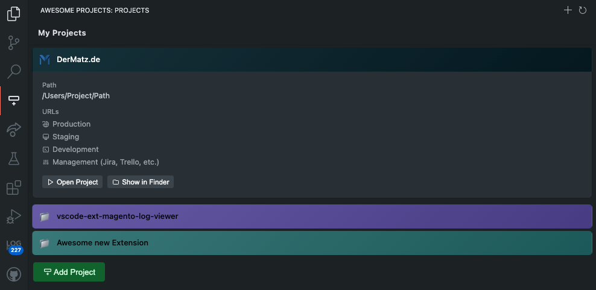

# Awesome-Projects 🤩 A Visual Studio Code Extension



## Note

This project is now a public Preview.
Please report Issues


## Description

The "awesome-projects" extension for Visual Studio Code helps you manage and organize your projects efficiently.
With this extension, you can easily add, open, and manage project urls directly from the VS Code sidebar.

## Features

- Add new projects to your list
- Open existing projects
- Refresh the list of projects
- Organize projects into categories such as Recent Projects and Favorites
- Manage project URLs (production, staging, development, and management)
- Assign custom colors to projects
- Create project shortcuts for quick access
- Sort projects with drag and drop

## Requirements

- Visual Studio Code version 1.96.0 or higher

## Getting Started

1. **Installation**
    - Open Visual Studio Code
    - Go to the Extensions view by clicking on the Extensions icon in the Activity Bar on the side of the window or by pressing `Ctrl+Shift+X`
    - Search for "awesome-projects"
    - Click Install

2. **Usage**
    - After installation, you can find the "awesome-projects" view in the sidebar.
    - Use the "Add Project" button to add new projects.
    - Click on a project to open it.
    - Use the refresh button to update the list of projects.
    - Manage project URLs directly from the sidebar by clicking on the project and editing the URLs.
    - Assign custom colors to projects for better organization.
    - Create shortcuts for quick access to frequently used projects.

## Settings

You can configure the extension using the `settings.json` file in Visual Studio Code. The following parameters are available:

- `awesomeProjects.projects`: An array of project objects. Each project object can have the following properties:
  - `path`: The file path of the project.
  - `name`: The name of the project.
  - `color`: (Optional) A color associated with the project.
  - `productionUrl`: (Optional) The production URL of the project.
  - `devUrl`: (Optional) The development URL of the project.
  - `stagingUrl`: (Optional) The staging URL of the project.
  - `managementUrl`: (Optional) The management URL of the project. Like Jira or other Project-Management Tools.

- `awesomeProjects.useFavicons`: A boolean value to enable or disable the use of favicons for projects. When enabled, the extension will attempt to fetch and display the favicon of the project's URL.

Example configuration:
```json
{
    "awesomeProjects.projects": [
        {
            "path": "/path/to/project1",
            "name": "Project 1",
            "color": "#ff0000",
            "productionUrl": "https://production-url.tld",
            "devUrl": "https://dev-url.tld",
            "stagingUrl": "https://staging-url.tld",
            "managementUrl": "https://management-url.tld"
        },
        {
            "path": "/path/to/project2",
            "name": "Project 2"
        }
    ],
    "awesomeProjects.useFavicons": true
}
```
