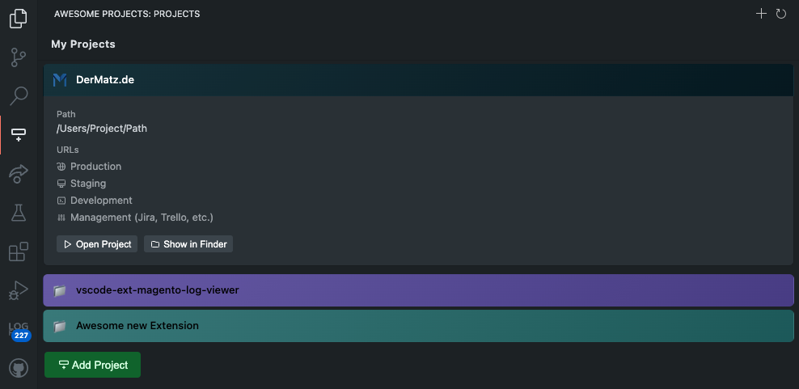

<div align="center">

# 🤩 Awesome Projects

**The smarter way to manage your VS Code projects**

[](https://marketplace.visualstudio.com/items?itemName=MathiasElle.awesome-projects)
[](https://marketplace.visualstudio.com/items?itemName=MathiasElle.awesome-projects)
[](https://marketplace.visualstudio.com/items?itemName=MathiasElle.awesome-projects)
[](https://app.codacy.com/gh/dermatz/vscode-ext-awesome-projects/dashboard)
[](LICENSE)



</div>

---

## What is Awesome Projects?

**Awesome Projects** is a Visual Studio Code extension that centralizes all your development projects in one place. Designed for developers who constantly switch between multiple repositories and environments, it gives you instant access to project folders, Git repositories, environment URLs, and more — all from a dedicated sidebar panel.

---

## ✨ Features

### 📂 Project Management

| Feature | Description |
|--------|-------------|
| **Drag & Drop Sorting** | Reorder projects intuitively by dragging them |
| **Custom Colors** | Assign colors to projects for quick recognition (includes random generator) |
| **Project Scanner** | Automatically scan directories to import Git repositories in bulk |
| **Multi-workspace Support** | Works across different VS Code workspaces |

### 🔗 Git Integration

| Feature | Description |
|--------|-------------|
| **Auto-detection** | Detects Git repositories automatically |
| **Submodule Support** | Recognizes and displays Git submodules |
| **URL Conversion** | Converts between SSH and HTTPS remote URLs |
| **Platform Links** | Direct links to GitHub, GitLab, and Bitbucket |

### 🌍 Environment Management

| Feature | Description |
|--------|-------------|
| **Multi-environment URLs** | Store Production, Staging, Dev, and Management URLs per project |
| **Favicon Detection** | Auto-fetches favicons for visual URL recognition |
| **One-click Access** | Open any environment URL directly from the sidebar |

### ⚙️ System Integration

| Feature | Description |
|--------|-------------|
| **File Manager** | Open project folders in Finder/Explorer/Nautilus |
| **Cross-platform** | Full support for Windows, macOS, and Linux |
| **Performance** | Optimized for large project collections with aggressive caching |

---

## 🚀 Getting Started

### Requirements

- Visual Studio Code **1.96.0** or higher
- Git *(optional — required for Git integration features)*

### Installation

1. Open VS Code and go to the **Extensions** panel (`Ctrl+Shift+X` / `Cmd+Shift+X`)
2. Search for **"Awesome Projects"**
3. Click **Install**
4. The 🤩 icon appears in the Activity Bar — click it to open the panel
5. Click **"+ Add Project"** to add your first project

> **Tip:** Use the **"Scan for Projects"** button to automatically import all Git repositories from a directory.

---

## ⚙️ Configuration

Projects are stored in VS Code settings and can be edited directly or managed through the UI.

```json
{
  "awesomeProjects.projects": [
    {
      "path": "/path/to/your/project",
      "name": "My Project",
      "color": "#0078D4",
      "productionUrl": "https://example.com",
      "stagingUrl": "https://staging.example.com",
      "devUrl": "http://localhost:3000",
      "managementUrl": "https://linear.app/my-team"
    }
  ],
  "awesomeProjects.useFavicons": true,
  "awesomeProjects.showGitInfo": true
}
```

### Settings Reference

| Setting | Type | Default | Description |
|---------|------|---------|-------------|
| `awesomeProjects.projects` | `array` | `[]` | List of configured projects |
| `awesomeProjects.useFavicons` | `boolean` | `true` | Show favicons next to environment URLs |
| `awesomeProjects.showGitInfo` | `boolean` | `true` | Display Git repository information |

### Project Fields

| Field | Required | Description |
|-------|----------|-------------|
| `path` | ✅ | Absolute path to the project folder |
| `name` | ✅ | Display name shown in the sidebar |
| `color` | — | HEX color for the project card accent |
| `productionUrl` | — | Production environment URL |
| `stagingUrl` | — | Staging environment URL |
| `devUrl` | — | Local development URL |
| `managementUrl` | — | Project management tool URL (Jira, Linear, etc.) |

---

## 🤝 Contributing

Contributions, bug reports, and feature requests are welcome!

- 🐛 [Report a bug](https://github.com/dermatz/vscode-ext-awesome-projects/issues/new?template=bug_report.md)
- 💡 [Request a feature](https://github.com/dermatz/vscode-ext-awesome-projects/issues/new?template=feature_request.md)
- 📖 [Read the contributing guidelines](CONTRIBUTING.md)

---

## 📄 License

Released under the [GNU General Public License v3.0](LICENSE).

---

## 🙏 Acknowledgments

- Icons by [Tabler Icons](https://tabler.io) — [MIT License](https://tabler.io/license)
- Color picker inspired by VS Code's built-in color picker
- ❤️ [Sponsor this project](https://github.com/sponsors/dermatz)
