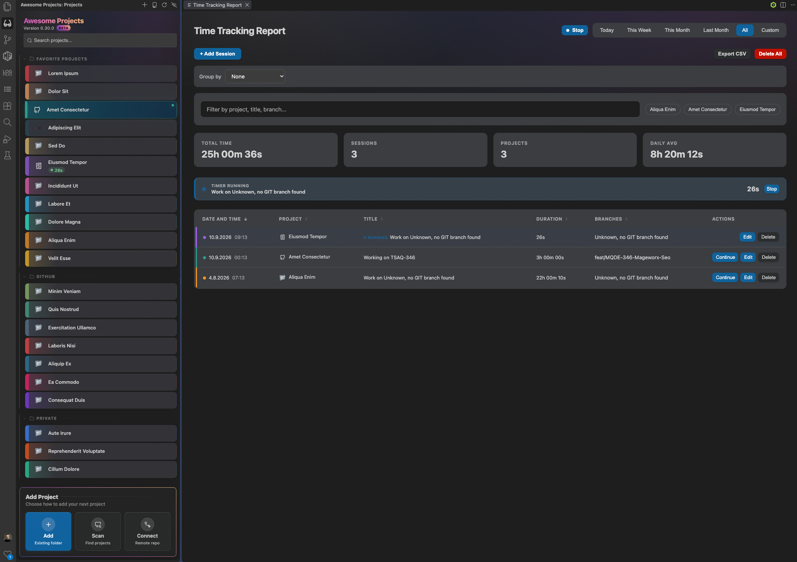

<div align="center">

# 🤩 Awesome Projects

**The smarter way to manage your VS Code projects**

[](https://github.com/dermatz/vscode-ext-awesome-projects/actions/workflows/test.yml)
[](https://github.com/dermatz/vscode-ext-awesome-projects/actions/workflows/release-please.yml)
[](https://github.com/dermatz/vscode-ext-awesome-projects/actions/workflows/semantic-pull-request.yml)
[](https://app.codacy.com/gh/dermatz/vscode-ext-awesome-projects/dashboard)
[](https://marketplace.visualstudio.com/items?itemName=MathiasElle.awesome-projects)
[](LICENSE)



</div>

---

## What is Awesome Projects?

**Awesome Projects** is a Visual Studio Code extension that centralizes all your development projects in one place. Designed for developers who constantly switch between multiple repositories and environments, it gives you instant access to project folders, Git repositories, environment URLs, time tracking, and more — all from a dedicated sidebar panel.

---

## ✨ Features

### 📂 Project Management

| Feature | Description |
|--------|-------------|
| **Drag & Drop Sorting** | Reorder projects intuitively by dragging them |
| **Custom Colors** | Assign colors to projects for quick recognition (includes random generator) |
| **Custom Icons** | Use Tabler Icons, emojis, or text as project icons |
| **Project Scanner** | Automatically scan directories to import Git repositories in bulk |
| **Multi-workspace Support** | Works across different VS Code workspaces |
| **Groups & Nesting** | Organize projects into collapsible nested groups with persistent state |
| **Inline Renaming** | Double-click a project title to rename it inline |
| **Live Search** | Filter the project list instantly as you type |
| **Current Project Badge** | Highlights the project that matches the open workspace |
| **Missing Project Handling** | Hide or show projects whose local path no longer exists |

### 🔗 Git & Remote Integration

| Feature | Description |
|--------|-------------|
| **Auto-detection** | Detects Git repositories automatically |
| **Submodule Support** | Recognizes and displays Git submodules |
| **URL Conversion** | Converts between SSH and HTTPS remote URLs |
| **Platform Links** | Direct links to GitHub, GitLab, and Bitbucket |
| **Remote Repositories** | Add and open remote repositories via VS Code's Remote Repositories workflow |

### 🌍 Environment Management

| Feature | Description |
|--------|-------------|
| **Multi-environment URLs** | Store Production, Staging, Dev, and Management URLs per project |
| **Favicon Detection** | Auto-fetches favicons for visual URL recognition |
| **Custom Icons per URL** | Override favicons with a custom `iconUrl` |
| **One-click Access** | Open any environment URL directly from the sidebar |

### ⏱️ Time Tracking

| Feature | Description |
|--------|-------------|
| **Session Tracking** | Start, stop, and continue time tracking sessions per project |
| **Auto-start** | Optionally start tracking automatically when a registered workspace opens |
| **Branch-aware Sessions** | Captures the current Git branch and extracts ticket IDs (e.g. `JIRA-123`) |
| **Status Bar Timer** | Shows the active timer in the VS Code status bar |
| **Extension Badge** | Displays a badge on the Activity Bar icon while a timer is running |
| **Time Tracking Report** | Visualize tracked time by day, week, month, or custom range |

### ⚙️ System Integration

| Feature | Description |
|--------|-------------|
| **File Manager** | Open project folders in Finder/Explorer/Nautilus |
| **Open in Terminal** | Launch a terminal in the project's root folder |
| **Open in New Window** | Open a project in a new VS Code window |
| **Reveal in Explorer** | Reveal the project folder directly in VS Code's Explorer panel |
| **Cross-platform** | Full support for Windows, macOS, and Linux |
| **Performance** | Optimized for large project collections with aggressive caching |
| **Status Bar** | Shows the current project name in the VS Code status bar — click to open the project list |
| **What's New** | In-extension panel highlighting new features after an update |

---

## 🚀 Getting Started

### Requirements

- Visual Studio Code **1.96.0** or higher
- Git *(optional — required for Git integration features)*

### Installation

1. Open VS Code and go to the **Extensions** panel (`Ctrl+Shift+X` / `Cmd+Shift+X`)
2. Search for **"Awesome Projects"**
3. Click **Install**
4. The 🤩 icon appears in the Activity Bar — click it to open the panel
5. Click **"+ Add Project"** to add your first project

> **Tip:** Use the **"Scan for Projects"** button to automatically import all Git repositories from a directory.

---

## ⚙️ Configuration

Projects are stored in VS Code settings and can be edited directly or managed through the UI. The project list is **machine-specific**, so it is not synchronized across devices via Settings Sync. This lets you maintain separate projects on different computers (for example, Mac and Windows).

```json
{
  "awesomeProjects.projects": [
    {
      "path": "/path/to/your/project",
      "name": "My Project",
      "color": "#0078D4",
      "icon": "brand-github",
      "group": "Work",
      "remoteUrl": "https://github.com/owner/repo",
      "productionUrl": "https://example.com",
      "stagingUrl": "https://staging.example.com",
      "devUrl": "http://localhost:3000",
      "managementUrl": "https://linear.app/my-team",
      "iconUrl": "https://example.com/favicon.png"
    }
  ]
}
```

### Settings Reference

#### Projects

| Setting | Type | Default | Description |
|---------|------|---------|-------------|
| `awesomeProjects.projects` | `array` | `[]` | List of configured projects (machine-specific, not synced) |
| `awesomeProjects.projects.hideMissing` | `boolean` | `false` | Hide projects whose local path no longer exists |
| `awesomeProjects.scan.depth` | `number` | `5` | Maximum recursion depth when scanning for Git projects |
| `awesomeProjects.scan.excludePatterns` | `array` | `["node_modules", "vendor", "dist", "build"]` | Folder names to exclude when scanning for Git projects |

#### Appearance

| Setting | Type | Default | Description |
|---------|------|---------|-------------|
| `awesomeProjects.appearance.useFavicons` | `boolean` | `true` | Show favicons next to environment URLs |
| `awesomeProjects.appearance.quickActionButtonDisplay` | `string` | `"hover"` | When to show quick action buttons: `always`, `hover`, or `hidden` |

#### Groups

| Setting | Type | Default | Description |
|---------|------|---------|-------------|
| `awesomeProjects.groups.sortOrder` | `string` | `"alphabetical"` | Sort order for project groups: `alphabetical`, `alphabetical-desc`, or `manual` |
| `awesomeProjects.groups.groupBy` | `string` | `"auto"` | Grouping mode: `auto`, `group-field`, or `flat` |

#### Status Bar

| Setting | Type | Default | Description |
|---------|------|---------|-------------|
| `awesomeProjects.statusBar.enabled` | `boolean` | `true` | Show the current project in the VS Code status bar |
| `awesomeProjects.statusBar.format` | `string` | `"$(folder) ${parent} > ${name}"` | Status bar text format. Placeholders: `${name}`, `${parent}`, `${path}` |

#### Updates

| Setting | Type | Default | Description |
|---------|------|---------|-------------|
| `awesomeProjects.updates.showUpdateNotification` | `boolean` | `true` | Show the What's New panel after an extension update |

#### Time Tracking

| Setting | Type | Default | Description |
|---------|------|---------|-------------|
| `awesomeProjects.timeTracking.enabled` | `boolean` | `true` | Enable the built-in time tracking feature |
| `awesomeProjects.timeTracking.autoStart` | `boolean` | `false` | Automatically start tracking when a registered workspace is opened |
| `awesomeProjects.timeTracking.tickIntervalSeconds` | `number` | `10` | How often the running timer is updated (1–300 seconds) |
| `awesomeProjects.timeTracking.statusBarEnabled` | `boolean` | `true` | Show the active timer in the status bar |
| `awesomeProjects.timeTracking.badgeEnabled` | `boolean` | `true` | Show a badge on the extension icon while a timer is running |
| `awesomeProjects.timeTracking.retentionDays` | `number` | `90` | Days to keep individual sessions before aggregating them |
| `awesomeProjects.timeTracking.extractTicketIdFromBranch` | `boolean` | `true` | Use ticket IDs from branch names as session titles |
| `awesomeProjects.timeTracking.ticketIdPattern` | `string` | `"[A-Z]{2,}-\\d+"` | Regex for extracting ticket IDs from branch names |
| `awesomeProjects.timeTracking.weekStartsOn` | `string` | `"sunday"` | First day of the week for the *This Week* report |
| `awesomeProjects.timeTracking.maxReportSessions` | `number` | `500` | Maximum number of sessions rendered in the Time Tracking Report |

### Project Fields

| Field | Required | Description |
|-------|----------|-------------|
| `path` | ✅ | Absolute path to the project folder or repository URL for remote projects |
| `name` | ✅ | Display name shown in the sidebar |
| `color` | — | HEX color for the project card accent |
| `icon` | — | Tabler Icons name (e.g. `brand-github`, `heart-filled`) or emoji/text for the project icon |
| `remoteUrl` | — | Remote repository URL. When set, the project opens via VS Code's Remote Repositories workflow |
| `isRemote` | — | Set internally for remote repository projects |
| `group` | — | Group name for organizing projects into collapsible sections |
| `productionUrl` | — | Production environment URL |
| `stagingUrl` | — | Staging environment URL |
| `devUrl` | — | Local development URL |
| `managementUrl` | — | Project management tool URL (Jira, Linear, etc.) |
| `iconUrl` | — | Custom favicon or icon URL. Overrides the favicon fetched from the Production URL |
| `timeSpentSeconds` | — | Accumulated tracked time for this project in seconds |

---

## 🤝 Contributing

Contributions, bug reports, and feature requests are welcome!

- 🐛 [Report a bug](https://github.com/dermatz/vscode-ext-awesome-projects/issues/new?template=bug_report.md)
- 💡 [Request a feature](https://github.com/dermatz/vscode-ext-awesome-projects/issues/new?template=feature_request.md)
- 📖 [Read the contributing guidelines](CONTRIBUTING.md)

---

## 📄 License

Released under the [GNU General Public License v3.0](LICENSE).

---

## 🙏 Acknowledgments

- Icons by [Tabler Icons](https://tabler.io) — [MIT License](https://tabler.io/license)
- Color picker inspired by VS Code's built-in color picker
- ❤️ [Sponsor this project](https://github.com/sponsors/dermatz)
